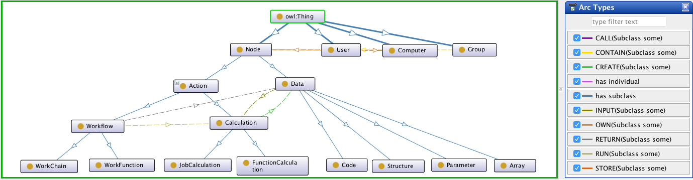

# AiiDA Ontology

This repository contains a basic ontological description of AiiDA graphs
in the [Web Ontology Language](https://www.w3.org/OWL/) (OWL).

**Note:** This is a work in progress, contributions are welcome!

## Usage

In order to edit or visualize the ontology, open the [aiida-ontology.rdf](aiida-ontology.rdf) in an ontology editor,
such as [Protégé](https://protege.stanford.edu/) or [WebProtégé](http://webprotege.stanford.edu/).
 

